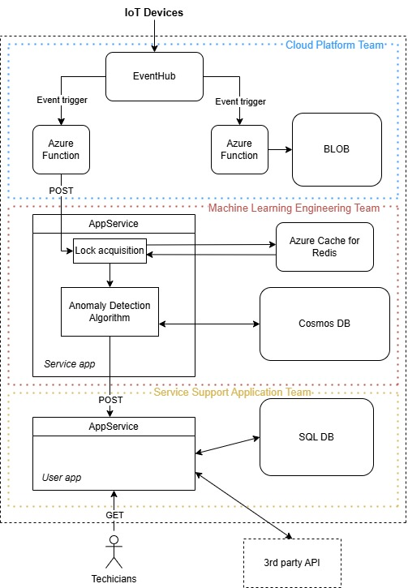
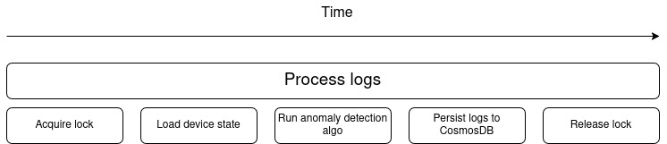

# Anomaly detection in log dumps from IoT Devices

## Assumptions:

- Blob storage: retention policy of 30 days, stored in zip for space saving, archive tier, rare access of data
- EventHub: dedicated pricing option, 2 consumer groups, log-based queue, partition key: deviceId
- AppService: premium pricing option

## Diagram



## Description

IoT devices send logs in batches to EventHUb, which has two consumer groups. Partition key is composed using deviceId, which ensures in-order consumption of logs from a single device. Consumers are two Azure Functions triggered by events:

**1**: saves logs to blob, key: timestamp+deviceId

**2**: sends HTTP POST request to the AppService (Service app) endpoint

_request contains: deviceId, location, timestamp, log_

**Service app**: BE
- unzips the log
- acquire the redis distributed lock from Azure Cache for Redis
- retreive the state form Cosmos DB by deviceId
- run Anomaly detection algotithm
- update/store the state
- release the lock
- send POST request to the User app (AppService)

_request contains: deviceId, location, timestamp, anomaly description_

**CosmosDB**: efficient big data operations, stores state in the document (JSON) format, key: DeviceId

**Redis cache**: install the locking library and redis client to the AppService, helps to manage locks across instances, ensures parallel (for different devices) and in-order processing

**User app**: BE + FE

- receives the request

POST:
- stores anomaly to the Anomalies table (SQL DB)


GET: 
- list of all unresolved anomalies for all devices that this technician with an id = 'id' maintains

`SELECT * FROM Anomalies a JOIN Devices d ON a.sDeviceId = d.sDeviceId WHERE d.sTechicianId = 'id' AND a.bResolved = 'F';`

Periodically:
- once a day query the 3rd party REST API for device-technician mapping update and store data in the Devices table: we assume that this information is not updated frequently

**SQL**: two tables, replicated (additional tables may be Techicians (with the name and other attributes), Location (with human-readable values))

**Devices**:

PK = sDeviceId
| **sDeviceId** | **sLocation**                        | **sTechicianId**                     |
| ------------- | ------------------------------------ | ------------------------------------ |
| device1       | c05a3ec5-7460-4f84-ba80-55ce62bf0e95 | 0c8af4d3-3d3b-4f43-b188-47910f3f00f0 |
| device2       | c05a3ec5-7460-4f84-ba80-55ce62bf0e95 | 86f9c9da-114b-46a1-b322-1a4875f92e2f |
| device3       | eb7a4b73-1451-4575-95a6-381b4cf90942 | 86f9c9da-114b-46a1-b322-1a4875f92e2f |


**Anomalies**:

PK = sDeviceId + dTimestamp

| **sAnomalyDescription**    | **sDeviceId** | **dTimestamp**       | **bResolved** |
| -------------------------- | ------------- | -------------------- | ------------- |
| Temperature threshold high | device1       | 2025-05-20T10:15:00Z | F             |
| Battery low                | device2       | 2025-05-21T14:30:00Z | T             |
| Connectivity lost          | device1       | 2025-05-22T09:00:00Z | F             |
| Sensor error               | device3       | 2025-05-22T08:00:00Z | F             |

## Traces
For demonstarting traces we chose request "Process logs" from the ML Engineering team component of the system.

```
[HTTP /processLogs] ──┬─ [Acquire Redis Lock]
                      ├─ [Load Device State from Cosmos DB]
                      ├─ [Run Anomaly Detection Algorithm]
                      ├─ [Persist State to Cosmos DB]
                      └─ [Release Redis Lock]
```



1. Root Span: HTTP Request
```json
{
  "traceId": "abc123",
  "spanId": "request001",
  "parentSpanId": null,
  "name": "HTTP POST /processLogs",
  "startTime": "2024-05-24T12:00:00.000Z",
  "endTime": "2024-05-24T12:00:00.300Z",
  "attributes": {
    "http.method": "POST",
    "http.route": "/processLogs",
    "http.status_code": 200,
    "device.id": "10-1234-5678",
    "content_length": 1048576
  }
}
```
2. Redis Lock Span
```json
{
  "traceId": "abc123",
  "spanId": "lock001",
  "parentSpanId": "request001",
  "name": "Acquire Redis Lock",
  "startTime": "2024-05-24T12:00:00.000Z",
  "endTime": "2024-05-24T12:00:00.020Z",
  "attributes": {
    "redis.command": "SETNX",
    "redis.key": "lock:10-1234-5678"
  }
}
```

3. Load State from Cosmos DB
```json
{
  "traceId": "abc123",
  "spanId": "dbread001",
  "parentSpanId": "request001",
  "name": "Read Device State",
  "startTime": "2024-05-24T12:00:00.021Z",
  "endTime": "2024-05-24T12:00:00.061Z",
  "attributes": {
    "db.system": "cosmosdb",
    "db.operation": "ReadItem",
    "db.container": "deviceState",
    "db.document.id": "10-1234-5678"
  }
}
```
4. Run Anomaly Detection
```json
{
  "traceId": "abc123",
  "spanId": "algo001",
  "parentSpanId": "request001",
  "name": "Run Anomaly Detection",
  "startTime": "2024-05-24T12:00:00.062Z",
  "endTime": "2024-05-24T12:00:00.212Z",
  "attributes": {
    "algo.name": "ThresholdModel",
    "algo.version": "v1.3",
    "anomalies.detected": 2
  }
}
```
5. Write State to Cosmos DB
```json
{
  "traceId": "abc123",
  "spanId": "dbwrite001",
  "parentSpanId": "request001",
  "name": "Update Device State",
  "startTime": "2024-05-24T12:00:00.213Z",
  "endTime": "2024-05-24T12:00:00.273Z",
  "attributes": {
    "db.system": "cosmosdb",
    "db.operation": "UpsertItem",
    "db.container": "deviceState",
    "db.document.id": "10-1234-5678"
  }
}
```
6. Release Redis Lock
```json
{
  "traceId": "abc123",
  "spanId": "unlock001",
  "parentSpanId": "request001",
  "name": "Release Redis Lock",
  "startTime": "2024-05-24T12:00:00.274Z",
  "endTime": "2024-05-24T12:00:00.284Z",
  "attributes": {
    "redis.command": "DEL",
    "redis.key": "lock:10-1234-5678"
  }
}
```
## Discussion of alternatives

- trigger on insertion to the blob storage: it doesn't provide data to the algorithm in near-realtime, streaming manner
- azure tables as an alternative to cosmos - (key-value) cheaper, no global distribution or multi-region support
- azure function instead of AppService - no state, must be stored in separate service/cache

## Limits

- lock bottleneck

## Metrics

| **Name**              | **Kind**            | **Description**                                                        | **Unit**     |
| --------------------- | ------------------- | ---------------------------------------------------------------------- | ------------ |
| `log_req_count`       | Counter             | Service app endpoint – measure incoming requests                       | -            |
| `active_lock_holders` | Async UpDownCounter | Service app – number of actively held locks in Redis distributed cache | -            |
| `alg_processing_time` | Histogram           | Service app – anomaly detection algorithm                              | Milliseconds |
| `confidence_level`    | Histogram           | Service app – anomaly detection algorithm                              | Percent (%)  |

## Bonuses

_"Devices and technicians are distributed across 6 regions around the world. How the architecture will change?"_

Replicate all the services (x6), we assume that a single device will send logs to the same (nearest) endpoint (EventHub), so all 6 instances can be fully isolated
Only Service Support App part can be in a single instance, because it only serves simple API requests and database R/W.
CosmosDB can be in single instance too (multi-region writes are inherently supported), if information from all devices is needed in a single place for machine learning purposes.

_"Optimize the costs of storage of log dumps in your system under following assumptions:
The data needs to be available for first 30 days after delivery to cloud for immediate analysis by engineers and retraining of machine learning algorithms.
After 30 days, the data are expected to not be used ever again. However, they should must be kept for unexpected future use cases.
What storage configuration would you choose?"_

Blob storage can store logs without periodic removal if we are willing to pay for it. Archive tier + storage in compressed formaat will optimize the cost.

_"The Service Support App Team would like to add new functionality to their application: Listing all devices in single location. Can you provide them with such data so they do not need to integrate inefficiently with the third party REST API?"_

`SELECT * FROM Devices WHERE sLocation = ?;`